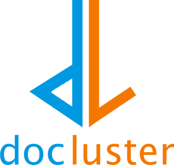

<p align="center">

</p>

<p align="center">

</p>

&nbsp;&nbsp;&nbsp;&nbsp;&nbsp;&nbsp;&nbsp;&nbsp;&nbsp;&nbsp;&nbsp;&nbsp;&nbsp;&nbsp;&nbsp;&nbsp;&nbsp;&nbsp;&nbsp;&nbsp;&nbsp;&nbsp;&nbsp;&nbsp;&nbsp;&nbsp;&nbsp;&nbsp;&nbsp;&nbsp;&nbsp;&nbsp;&nbsp;
[](https://pypi.python.org/pypi/docluster)
[](https://travis-ci.org/metinsay/docluster)
[](https://github.com/metinsay/docluster/issues)
[](https://docluster.re˜t/?badge=latest)
[](https://pyup.io/repos/github/metinsay/docluster/)
[](https://opensource.org/licenses/MIT)


**docluster** is an open source project that aims to bring the natural language processing community together. The demand for NLP increases each year as processing power increases and machine learning advances. As a result, many research projects are conducted on NLP and related subjects. Keeping up with these advancements from all around the world is nearly impossible. `docluster` tries to bring all studies from all countries into a library that can be easily applied, visualized and deployed.

**You want to contribute? Great! See [Contribute](./CONTRIBUTING.rst) section.**

## Vision

Natural language processing space is populated with many individual and organizational projects that provide specific needs of consumer. Unfortunately none so far tries to serve future innovation. `docluster` aims to fill this void by being:

**Free:** Many projects that provide powerful NLP tools come with a price attach to it (usually a monthly subscription or a per request). Even seeing the 'Pricing' tab on the website of these projects, discourages people who are genuinely interested to contribute. `docluster` aims to break this wall by providing these tools and many more with open source code.

**Up-to-date on research:** There are so many research projects conducted that it is almost impossible to keep up. These projects are usually presented through a white paper and occasionally a repo separately created just for that particular research. `docluster` aims to keep people up-to-date by bringing tools in a singular repo.

**Open to contributions:** Large organizations such as Google, Facebook, MIT are the leading most of the research projects in NLP. However, there are many individuals who are making innovative contributions to the community. `docluster` aims to be a platform for these individuals. All the credit still stay with the individual that invented the new model.

**All-language support:** Although language is a major factor in NLP, most efforts are put into more common languages like English. However, there are research projects in other languages as well and these projects are usually conducted in their respective country. `docluster` tries to join all these research projects by inviting people from all around the world to contribute.

**Easy to use:** Many NLP models require some sort of training step before any usage. `docluster` gives the user the option to train their models or use a pre-trained model. It comes with a pre-trained model catalog where users can programmatically download or upload pre-trained model.

## Upcoming Features

* Most recent research models:

    ```python
    ft = FastText()
    embeddings = ft.fit(docs)
    ```

* **Docluster Package Manager** (DPM) gives access to:

    * Pre-trained models</br></br>

    ```python
    # Word2Vec pre-trained with English Wikipedia
    word2vec = dpm.download_model('docluster/word2vec_en_wikipedia').model
    ```
    * Corpus Catalog</br></br>

    ```python
    # Random half of English Wikipedia documents
    wikis = dpm.download_corpus('docluster/wikipedia_en', shuffle=True, fraction=0.5).text
    ```

* **Flow** - A powerful pipelining tool with branching. Underlying graph can consist of unconnected subgraphs.

    ```python
    pre = Preprocessor()
    tfidf = TfIdf(min_df=0.2, max_df=0.5)
    km = BisectingKMeans(2, dist_metric=DistanceMetric.manhattan)
    db = DBScan()

    # pre - tfidf - kmeans
    #            \
    #             db

    flo = Flow(do_thread_branches=True)
    flo.chain(pre, tfidf, km)
    flo.link(tfidf, db)
    km_clusters, db_clusters = flo.fit(docs)
    ```


* Built-in progress visualization

    ```python
    # Plots a voronoi diagram that adapts to new cluster assignments on each epoch
    km = Kmeans(4, plot_progress=True, plot_result=True)
    clusters = km.fit(docs)
    ```

## Installation

**The project is under heavy construction currently.**

## Contribute

We really expect this project to be the project of the community. Therefore, we welcome EVERY contribution from everyone that are interested in NLP or related areas. Please check out [how to contribute](./CONTRIBUTING.md). If you have any questions after reading the documents, contact the admins of the project.

## Release History

Project is still in development.

## Maintainers

**Metin Say -** MIT '19. metin@mit.edu

See a list of all contributers at [Authors](AUTHORS.md).

## Puzzle

**Hint 1:** Do not ignore me!

(We recommend cloning the repo before starting the puzzle.)
